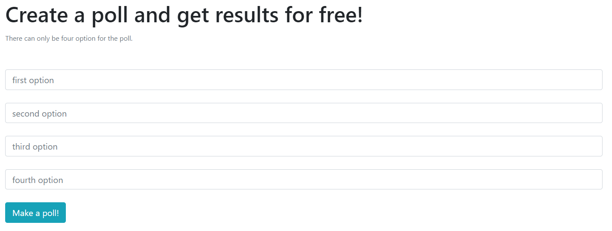
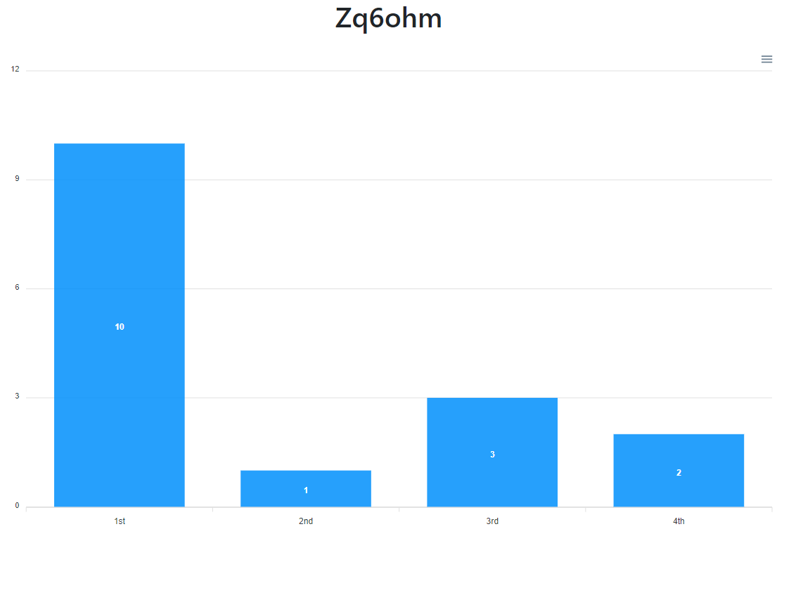

# Poll application

A full stack application made using `node.js` `express.js` and `mongoDb` as database.

# The libraries used

- expres
- mongoose
- ejs
- @hapi/joi

# the frontend

On the front, we have set views to make the application interactive, and the view engine is `ejs`.




# The endpoints of the applicion

```
/ -> to make a new poll
/poll/:redirectKey -> to vote a poll
/polls/results/:redirectKey -> to view the result of a particular poll
```

# The procedure to run the app

Start the project using `npm run dev` and go on to `localhost:3000` to view your application in action. Make sure to Start the mongoDb server using `mongod` or your application wont run nicely.

# How Are poll Id's generated?

In the project, we have created a foler as `functions`, where there is a file as `makeid.js`, which has the following code.

```javascript
module.exports = function (length) {
  var result = "";
  var characters = "ABCDEFGHIJKLMNOPQRSTUVWXYZabcdefghijklmnopqrstuvwxyz0123456789";
  var charactersLength = characters.length;
  for (var i = 0; i < length; i++) {
    result += characters.charAt(Math.floor(Math.random() * charactersLength));
  }
  return result;
};
```

This program generates Random id's that can be used as poll id or `redirectKey` for each of the polls.

<b>Enjoy your powerful application</b>
